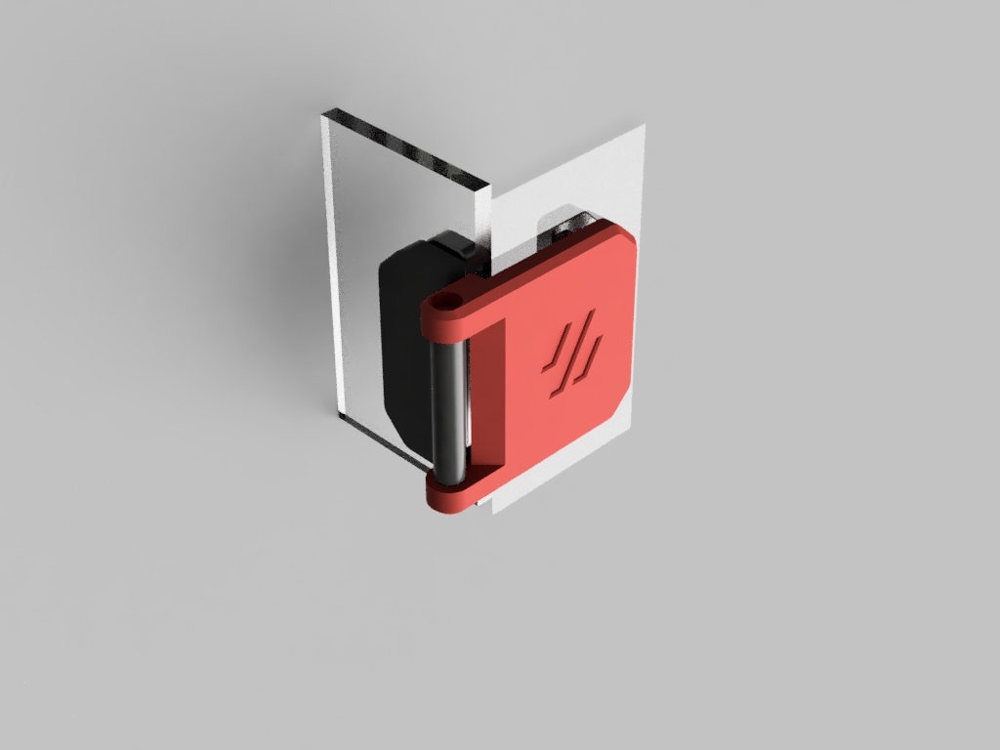

# 270° Hinge for the Switchwire

This Mod is based on [chrisrgonzales](https://github.com/VoronDesign/VoronUsers/tree/master/printer_mods/chrisrgonzales/270_degree_hinge) 270° hinges for printers with extrusions around the door, specifically the V2 and Trident.
This modification screws onto a sidepanel, e. g. a acrylic panel like the Switchwire uses. Also the M3x35 SHCS is replaced with an M3x40 to stay conform to the Switchwire BOM.


## BOM

This hinge uses only the standard hardware of the Switchwire

```
M3 threaded insert  [x16]
M3x12 FHCS          [x16]
M3x40 SHCS          [x4]
```

## Printing

Use the default recommendes print settings for Voron parts.
Due to the Voron logo on the FacePlate you have to print two left and two right FacePlates so you can put in your screws from the top.
Depending on your panel thickness you have to choose the right BackPlate and FacePlate. For the standard 3mm BOM panels use the files in the 3mm folder. My panels are 4mm thick. If yours are too, use the 4mm version.
Print 4 SideMounts. These are independent from panel thickness and orientation.

## Assembly

Drill 3mm or 3,5mm holes into your panels. I recommend drilling 3,5mm holes to have a little bit of wiggle room to adjust. The spacing between the holes is 25mm. For simplification, the drilling template can be used.
Insert the threaded inserts into the Faceplate and SideMount (2 each). Please note that the spacing for the holes of the SideMount to the front depends on the panel thickness of your doors.
The panels are clamped between the Backplate and the outer piece (SideMount or FacePlate). For this use the M3x12 FHCS. Note the orientation of your Faceplates.
